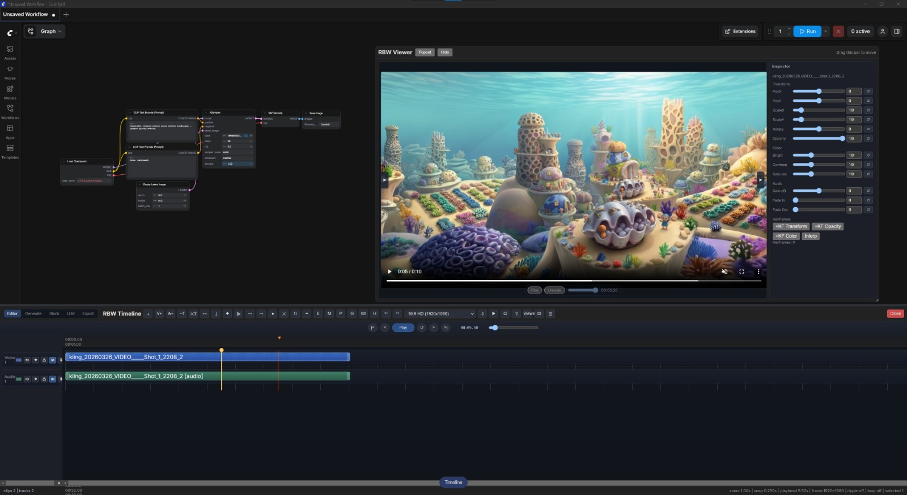

# 🎬 ComfyUI Timeline

An interactive, multi-track **video timeline editor** embedded directly inside the [ComfyUI](https://github.com/comfyanonymous/ComfyUI) canvas interface.



---

## ✨ Features

- **📺 Multi-Track Timeline Editor**: Video and audio tracks with per-track Solo, Mute, Lock, and Visibility controls.
- **✂️ Non-Linear Clip Editing**: Drag-and-drop, trimming, razor cuts, ripple editing, and box selection.
- **🧲 Precision Snapping Engine**: Snap to clip edges, markers, playhead, and configurable grid intervals.
- **🎛️ Inspector Panel**:
  - Transform controls (Position, Scale, Rotation, Opacity)
  - Color correction & adjustments
  - Audio gain, pan, and fade in/out
  - Keyframing with custom interpolation
- **📂 Asset Bin**: Folder tree management, grid/list view, search filters, and direct drag-to-timeline.
- **🔊 Waveform & Thumbnail Generation**: Real-time Web Audio waveform rendering and frame thumbnail previews.
- **⚡ Playback Controls**: J/K/L shuttle controls, loop range, and I/O in/out point selection.
- **⏪ Undo / Redo System**: 80-step local history stack + automated server-side project autosaving (up to 100 snapshots).
- **🚀 FFmpeg Render Pipeline**: Direct export to H.264, H.265, ProRes, or WebM with composite transforms, opacity blending, and multi-track audio mixing.
- **🔗 ComfyUI Workflow Integration**: Queue clips directly from the timeline into the ComfyUI execution queue.
- **📁 Import & Export**: Full project export/import as JSON.

---

## 📦 Installation

### Option 1: Via Git Clone (Recommended)

1. Open your terminal and navigate to your `ComfyUI/custom_nodes/` directory:
   ```bash
   cd ComfyUI/custom_nodes/
   ```

2. Clone this repository:
   ```bash
   git clone https://github.com/nucciocanino/-ComfyUI-Timeline.git
   ```

3. **Prerequisite**: Make sure `ffmpeg` and `ffprobe` are installed on your system and accessible in your system `PATH` (required for video rendering and audio extraction).
   - **Windows**: Download from [ffmpeg.org](https://ffmpeg.org/download.html) and add `bin/` to system PATH.
   - **Linux**: `sudo apt install ffmpeg`
   - **macOS**: `brew install ffmpeg`

4. Restart ComfyUI.

---

## 🚀 How to Use

1. **Open the Timeline**: Click the floating **"Timeline"** button in the bottom-right corner of the ComfyUI canvas (or press shortcut `T`).
2. **Import Media**: Open the **Asset Bin** panel and upload video/audio files or generated frames.
3. **Assemble Tracks**: Drag assets onto video and audio tracks on the timeline.
4. **Queue to ComfyUI Workflow**:
   - Assign a ComfyUI workflow to a clip via the **Inspector** panel.
   - Right-click the clip and select **Queue Clip**.
5. **Render Export**: Click **Render** in the timeline toolbar to export the composite video using FFmpeg.

---

## ⌨️ Shortcuts

| Shortcut | Action |
|---|---|
| `Space` | Play / Pause |
| `J` / `K` / `L` | Shuttle backwards / Stop / Shuttle forwards |
| `T` | Toggle Timeline Panel |
| `S` | Split clip at playhead (Razor tool) |
| `Delete` / `Backspace` | Delete selected clip(s) |
| `Ctrl` + `Z` / `Cmd` + `Z` | Undo |
| `Ctrl` + `Y` / `Cmd` + `Shift` + `Z` | Redo |
| `I` / `O` | Set In / Out point |

---

## 📁 Repository Structure

```
ComfyUI-Timeline/
├── __init__.py            # ComfyUI extension entrypoint & route setup
├── api.py                 # REST API endpoints (/rbw_timeline/*)
├── service.py             # Business logic & FFmpeg render pipeline
├── models.py              # Data structures (Clips, Tracks, Assets)
├── persistence.py         # Project JSON loading/saving & autosaves
├── comfy_adapter.py       # Integration with ComfyUI prompt queue
├── js/
│   └── timeline_ext.js    # Injected UI extension (floating button & panel)
├── web/                   # Built viewer app served at /rbw_timeline/ui
├── openvideo_app/         # Source code for the web viewer (Vite + OpenVideo)
├── pyproject.toml         # Package metadata
├── LICENSE                # MIT License
└── README.md
```

---

## 🛠️ Modifying & Rebuilding the Web UI (Optional)

The pre-built Web UI is included in the `web/` directory. If you wish to make changes to the Web Codecs viewer application:

```bash
cd openvideo_app
npm install
npm run build
```

---

## 📄 License

This project is licensed under the **MIT License** - see the [LICENSE](LICENSE) file for details. Free to use, modify, and distribute for personal or commercial projects.
